<p align="center">
  <a href="README.md">简体中文</a> · <a href="README_EN.md">English</a> · <a href="README_JA.md">日本語</a> · <a href="README_KO.md">한국어</a> · <a href="README_ES.md">Español</a>
</p>

<p align="center">
  
</p>

# wechat-chat-export-macos

> Export only the plain-text messages you sent from your own local WeChat database on macOS.

This is a safety-first Agent Skill for **Codex** and **Claude Code**. It captures and verifies the WeChat 4.1.10 database passphrase, decrypts a copy of the message database, selects only messages authored by the confirmed account, restores the official WeChat signature, and removes key/decrypted intermediates.

## Why

WeChat has no "export only what I wrote" button. This project creates a clean personal corpus for:

- distilling your writing style;
- reviewing your past language and decisions;
- training a personal writing agent without mixing in other people's messages;
- producing text-only TXT and JSONL outputs.

## Safety model

- **Own messages only:** resolve the account row id from `Name2Id`, then require `local_type = 1 AND real_sender_id = self_rowid`.
- **No guessed keys:** a captured candidate is saved only after PBKDF2 derivation and page-1 HMAC verification.
- **No SIP disable:** the verified 4.1.10 path temporarily ad-hoc signs a previously backed-up app.
- **Fail closed:** stop on unknown versions, moved/duplicate signatures, failed HMAC, unresolved WAL, or an invalid official backup.
- **Restore WeChat:** verify and restore the original TeamIdentifier on success or failure.
- **Clean intermediates:** remove passphrases, database keys, decrypted databases, and debug logs.

**This repository contains no real chats, wxids, databases, passphrases, or keys.** The self-test uses synthetic records only.

## Compatibility

| Environment | Status |
|---|---|
| Apple Silicon macOS + WeChat 4.1.10 | Verified |
| Intel Mac | Not supported |
| Other WeChat versions | Stop by default; never guess a breakpoint |
| Windows / Linux | Out of scope |

See [`references/compatibility.md`](references/compatibility.md) for the exact verified build and upstream boundaries.

## Install

### Codex

```bash
git clone https://github.com/ai-martin-lau/wechat-chat-export-macos.git \
  ~/.codex/skills/wechat-chat-export-macos
```

### Claude Code

```bash
git clone https://github.com/ai-martin-lau/wechat-chat-export-macos.git \
  ~/.claude/skills/wechat-chat-export-macos
```

Then ask:

```text
Export only the text messages I sent from the local WeChat database on this Mac for writing-style analysis.
```

The agent diagnoses the version, account, databases, and signature first. It must ask before modifying the WeChat signature.

## Workflow

```mermaid
flowchart LR
  A["Diagnose version and account"] --> B["Back up official WeChat"]
  B --> C["Temporary ad-hoc signature"]
  C --> D["Capture passphrase with LLDB"]
  D --> E["PBKDF2 and HMAC verification"]
  E --> F["Decrypt a message DB copy"]
  F --> G["Select own text only"]
  G --> H["Restore official signature"]
  H --> I["Delete secrets and decrypted DBs"]
```



## Output

```text
我的微信原文.txt
我的微信原文.jsonl
```

Each JSONL line has one field only:

```json
{"text":"one message authored by you"}
```

Local timestamps and database identifiers are emitted only with the explicit `--audit` option.

## Doctor and self-test

```bash
python3 scripts/inspect_wechat.py
python3 scripts/find_cipher_hook.py --app /Applications/WeChat.app --json

python3 -m venv .venv
.venv/bin/pip install -r scripts/requirements.txt
.venv/bin/python scripts/self_test.py
```

Expected result:

```text
self_test=ok real_chat_data_used=false
```

## Important limitations

- Only history already present in this Mac's local database can be exported. Phone-only history must first be migrated successfully.
- An encrypted WAL may contain newer uncheckpointed messages. The Skill does not silently ignore it.
- WeChat updates can move internal functions. A signature mismatch is a stop condition, not an invitation to guess.
- This is a safety-oriented Agent Skill, not an unattended one-click GUI.

## Original contributions and technical sources

This repository contributes:

- a verified unique `wechat.dylib` function signature for WeChat 4.1.10 on Apple Silicon macOS;
- a complete no-SIP-disable workflow that backs up and restores the official app signature;
- a verified chain from passphrase capture through PBKDF2, HMAC, and page decryption;
- an own-author-only exporter based on `real_sender_id`, producing a text-only corpus;
- executable Codex and Claude Code guidance with version, WAL, privacy, and restoration guardrails.

The underlying WCDB/SQLCipher format research, LLDB capture patterns, and WeChat 4.1+ passphrase model build on prior open-source work from:

- [ydotdog/wechat-export-macos](https://github.com/ydotdog/wechat-export-macos)
- [lopleec/wxchat-export](https://github.com/lopleec/wxchat-export)
- [Thearas/wechat-db-decrypt-macos](https://github.com/Thearas/wechat-db-decrypt-macos)
- [ylytdeng/wechat-decrypt](https://github.com/ylytdeng/wechat-decrypt)
- [TANGandXUE/wcdb-key-tool](https://github.com/TANGandXUE/wcdb-key-tool)
- [BIBOYANG425/wechat-chat-history-mac](https://github.com/BIBOYANG425/wechat-chat-history-mac)

See [`references/compatibility.md`](references/compatibility.md) for what each project covers.

## Responsible use

Use this project only with local data from your own device and account. Do not use it on devices or accounts without authorization. This project is not affiliated with or endorsed by Tencent or WeChat; all related trademarks belong to their respective owners.

## License

MIT

## Star history

[](https://star-history.com/#ai-martin-lau/wechat-chat-export-macos&Date)
